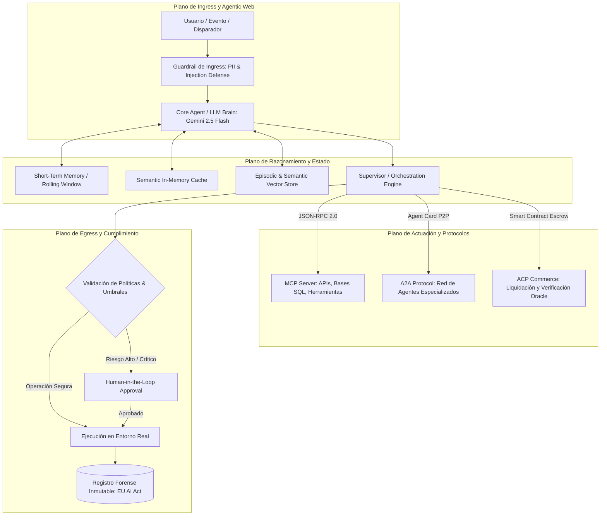
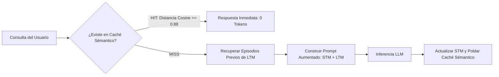
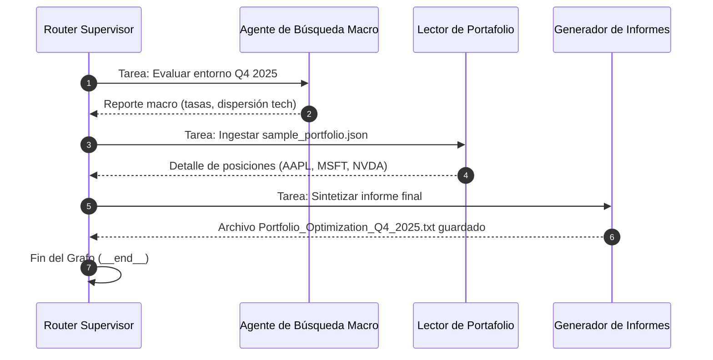
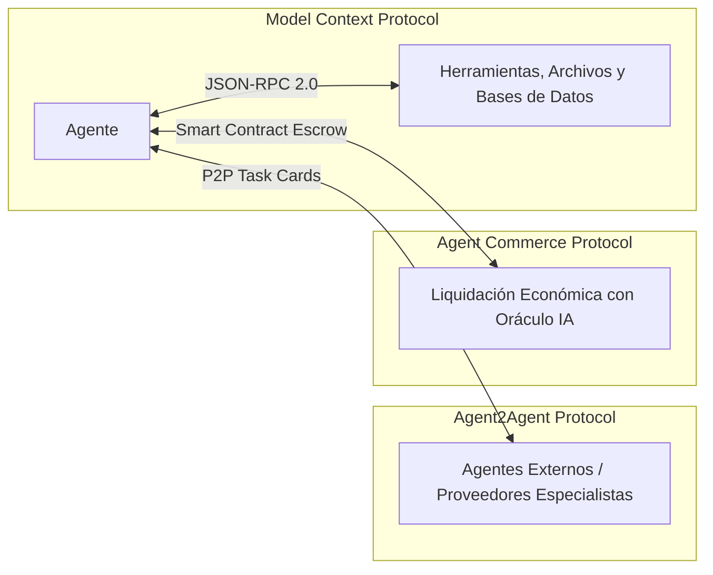
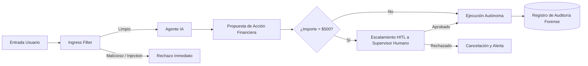

# AI Agents in Practice: From Cognitive Foundations to Next-Gen Protocols

[](LICENSE)
[](https://www.python.org/)
[](https://ai.google.dev/)
[](https://docs.pydantic.dev/)
[](https://ubuntu.com/)

Un repositorio técnico de referencia que recorre la arquitectura completa del ciclo de vida agentico: desde los fundamentos cognitivos de inferencia y loops ReAct, hasta la orquestación distribuida, protocolos de interoperabilidad abierta (MCP, A2A, ACP) y defensas éticas multi-nivel para producción.

---

## 🏗️ Mapa de Navegación del Repositorio

El proyecto implementa un enfoque **code-first** donde cada capítulo dispone de su propia arquitectura aislada, esquemas Pydantic v2 y trazas de ejecución en tiempo real verificadas en Ubuntu (`llm-node`):

```text
ai-agents-in-practice/
├── README.md                                  # Visión global y arquitectura del proyecto (este archivo)
├── chapter-01-foundations/                    # Fundamentos: LLMs, Inferencia y RAG Estático
│   ├── README.md
│   └── src/
├── chapter-02-rise-of-agents/                 # El Loop ReAct y la Anatomía Básica del Agente
│   ├── README.md
│   └── src/
├── chapter-03-orchestrators/                  # Orquestadores: Abstracción, Flujos y Jerarquías
│   ├── README.md
│   └── src/orchestrator.py
├── chapter-04-memory/                         # Taxonomía de Memoria: STM, Caché Sémantico y LTM Episódica
│   ├── README.md
│   └── src/memory_agent.py
├── chapter-05-tools/                          # Integración de Herramientas: Sync, Async (I/O) y RAG Agentico
│   ├── README.md
│   └── src/tool_integration_agent.py
├── chapter-06-langchain-agent/                # Agente de Comercio Electrónico Integral (AskMamma)
│   ├── README.md
│   └── src/ask_mamma_agent.py
├── chapter-07-multi-agent/                    # Sistemas Multi-Agente y Orquestación por Grafos (LangGraph)
│   ├── README.md
│   └── src/portfolio_supervisor.py
├── chapter-08-protocols/                      # Protocolos de Próxima Generación: MCP, A2A y ACP
│   ├── README.md
│   └── src/agent_protocols.py
└── chapter-09-ethics-guardrails/              # Ética, Detección de Inyecciones, HITL y Auditoría Forense
    ├── README.md
    └── src/guardrail_pipeline.py
```

---

## 🧠 Arquitectura Global del Sistema Agentico

A lo largo de los capítulos, el sistema evoluciona desde llamadas directas hacia una arquitectura desacoplada y descentralizada compuesta por tres planos operativos:



---

## 📚 Síntesis Modular por Capítulos

### 1. Fundamentos & Inferencia (`chapter-01-foundations`)
* **Concepto:** Diferencia entre generación de texto estática y razonamiento adaptativo.
* **Técnica:** Despliegue de los primeros prompts estructurados y canalizaciones RAG deterministas.

### 2. El Surgimiento de los Agentes (`chapter-02-rise-of-agents`)
* **Concepto:** El bucle fundamental **Thought $\rightarrow$ Action $\rightarrow$ Observation** (ReAct).
* **Entregable:** Implementación de un agente reactivo capaz de introspección e inspección de salidas intermedias.

### 3. La Necesidad de un Orquestador (`chapter-03-orchestrators`)
* **Concepto:** Por qué las aplicaciones agenticas superan los scripts `if...else`. Autonomía, abstracción y modularidad.
* **Entregable:** Un orquestador supervisor jerárquico que descompone objetivos complejos y delega subtareas a trabajadores especializados (`data_retrieval`, `alert_dispatch`).

### 4. Gestión de Memoria y Contexto (`chapter-04-memory`)
* **Concepto:** La taxonomía cognitiva de CoALA (Short-Term, Semantic, Episodic y Procedural).
* **Entregable:** Un agente con búfer circular de ventana deslizante, condensación por LLM, **caché sémantico en memoria** sin costo de tokens, y recuperación episódica vectorial.



### 5. Herramientas e Integraciones Externas (`chapter-05-tools`)
* **Concepto:** Las herramientas como actuadores del agente en el entorno digital.
* **Entregable:** Contratos Pydantic v2, traducción texto-a-SQL sobre SQLite, consultas concurrentes no bloqueantes (`asyncio.gather`) y RAG agentico con reformulación dinámica de consultas.

### 6. Agente Integral con LangChain (`chapter-06-langchain-agent`)
* **Concepto:** Unificación de los pilares **Build**, **Run** y **Manage** (LangSmith).
* **Entregable:** **AskMamma**, asistente interactivo para un restaurante digital (*Mammachepiada*) que combina diálogo natural, inventario en SQLite, certificados de higiene en RAG y mutación transaccional de carrito.

### 7. Aplicaciones Multi-Agente (`chapter-07-multi-agent`)
* **Concepto:** Microservicios aplicados a IA. Topologías en red, reflexión, pipelines secuenciales y jerarquías supervisadas.
* **Entregable:** Sistema jerárquico supervisor que analiza portafolios financieros (`sample_portfolio.json`), analiza tendencias de mercado en paralelo y sintetiza un informe formal (`.txt`).



### 8. Protocolos de Próxima Generación (`chapter-08-protocols`)
* **Concepto:** Pasar de aplicaciones monolíticas al estándar del **Agentic Web**.
* **Entregable:** 
  * **MCP (Anthropic):** Servidor/Cliente JSON-RPC 2.0 con esquemas estructurados para consulta de activos.
  * **A2A (Google):** Descubrimiento y delegación horizontal entre pares mediante `agent-card.json`.
  * **ACP (Virtuals):** Contratos de custodia (*escrow*), identidades con criptobilleteras y verificación oracular con IA.



### 9. Desafíos Éticos, Guardrails & Gobernanza (`chapter-09-ethics-guardrails`)
* **Concepto:** Responsabilidad operacional, sesgo algorítmico, prevención de manipulaciones y cumplimiento con el **EU AI Act**.
* **Entregable:** Pipeline de defensa en capas con ofuscación automática de PII (emails, tarjetas), filtro de inyecciones (*Deceptive Delight*), escalamiento **Human-in-the-Loop** en transacciones críticas (> $500) y registro forense inmutable.



---

## 🛠️ Stack Tecnológico

| Componente | Tecnología | Propósito |
| :--- | :--- | :--- |
| **Lenguaje Core** | Python 3.11+ | Entorno de desarrollo unificado |
| **Modelos LLM** | Google Gemini (`gemini-2.5-flash`) | Motor de razonamiento, extracción y síntesis |
| **SDK Principal** | `google-genai` | Interfaz nativa y estructurada con endpoints de Gemini |
| **Contratos de Datos** | Pydantic v2 | Validación de esquemas, JSON Schema y tipado estricto |
| **Orquestación de Grafos**| LangGraph / StateGraph | Máquinas de estado cíclicas y control de transiciones |
| **Bases de Datos** | SQLite (in-memory & persistente) | Gestión de inventario relacional y logs de auditoría forense |
| **Computación Vectorial** | Vectores densos & Similaridad Coseno | Caché sémantico en memoria y recuperación episódica |
| **Protocolos Soportados**| MCP (JSON-RPC 2.0), A2A, ACP | Interoperabilidad de herramientas, comunicación P2P y liquidación |

---

## 🚀 Puesta en Marcha Rápida

### 1. Clonar el Repositorio
```bash
git clone git@github.com:OscarTMa/ai-agents-in-practice.git
cd ai-agents-in-practice
```

### 2. Configurar el Entorno Virtual
```bash
python3 -m venv .venv
source .venv/bin/activate
pip install -r requirements.txt
```

### 3. Configurar Variables de Entorno
Crea un archivo `.env` en la raíz del proyecto:
```bash
GOOGLE_API_KEY="tu-api-key-de-google-gemini"
```

### 4. Ejecución de Módulos Clave
```bash
# Capítulo 3: Orquestador Jerárquico
python3 chapter-03-orchestrators/src/orchestrator.py

# Capítulo 4: Memoria Cognitiva (STM, Caché y LTM)
python3 chapter-04-memory/src/memory_agent.py

# Capítulo 5: Integración de Herramientas (Sync/Async/RAG)
python3 chapter-05-tools/src/tool_integration_agent.py

# Capítulo 6: Agente Integral AskMamma
python3 chapter-06-langchain-agent/src/ask_mamma_agent.py

# Capítulo 7: Multi-Agente con Supervisor
python3 chapter-07-multi-agent/src/portfolio_supervisor.py

# Capítulo 8: Protocolos de Nueva Generación (MCP, A2A, ACP)
python3 chapter-08-protocols/src/agent_protocols.py

# Capítulo 9: Guardrails Éticos y Human-in-the-Loop
python3 chapter-09-ethics-guardrails/src/guardrail_pipeline.py
```

---

## 📜 Licencia

Distribuido bajo la Licencia **MIT**. Consulta el archivo `LICENSE` para más detalles.
