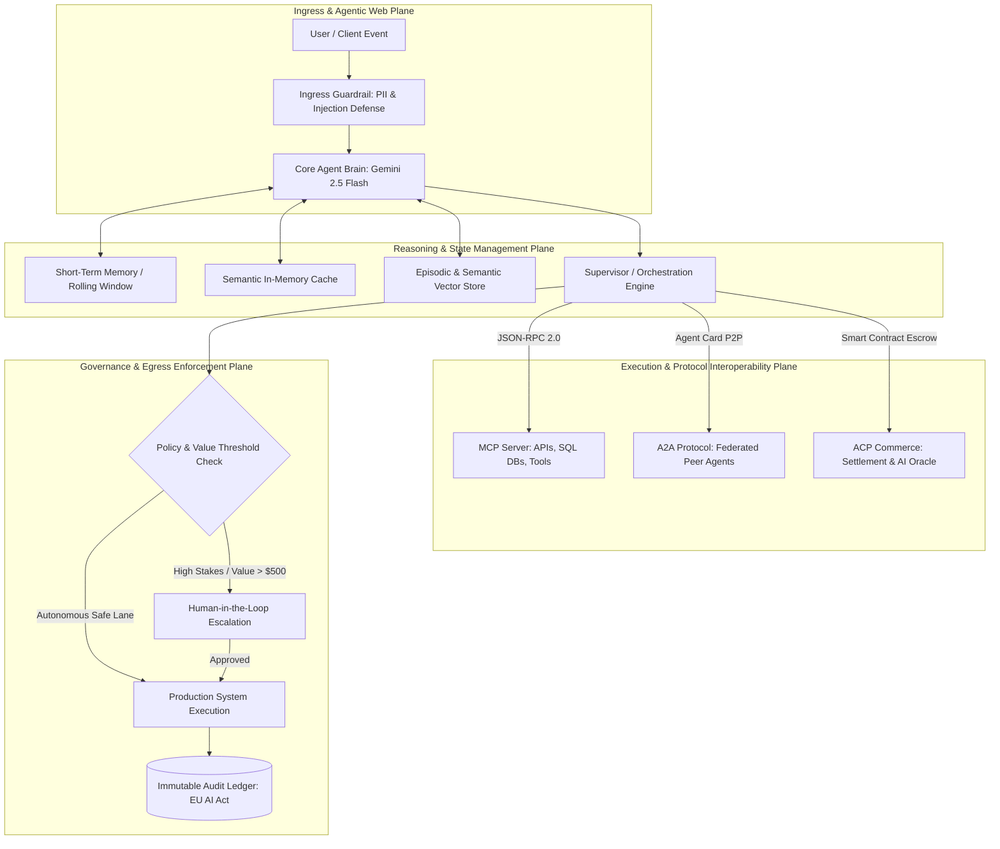
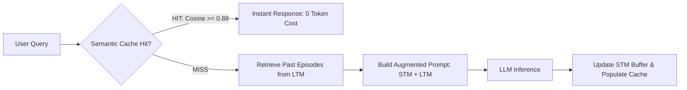
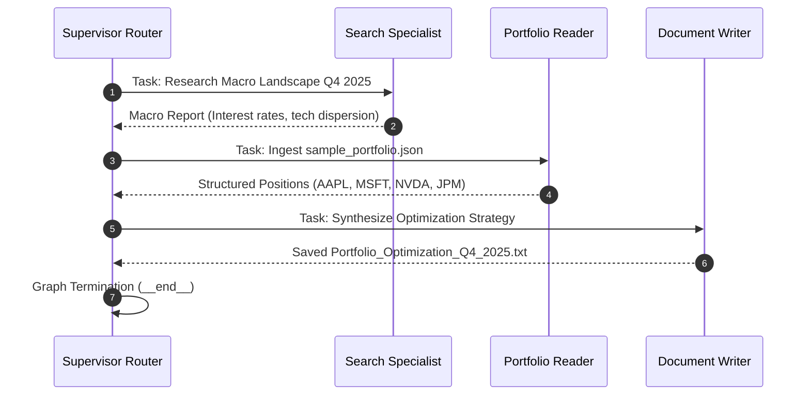
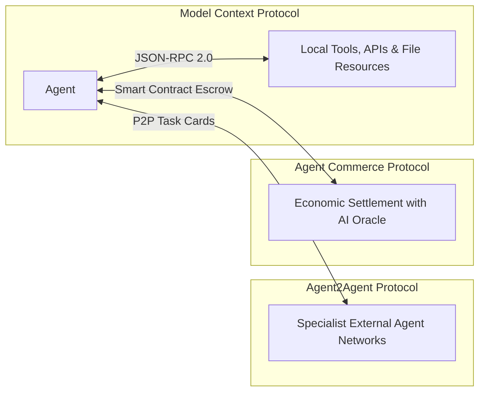
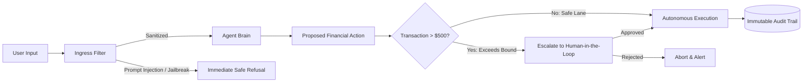

# AI Agents in Practice: From Cognitive Foundations to Next-Gen Protocols

[](LICENSE)
[](https://www.python.org/)
[](https://ai.google.dev/)
[](https://docs.pydantic.dev/)
[](https://ubuntu.com/)

A practical, code-first technical repository covering the entire agentic architecture lifecycle: from cognitive inference foundations and ReAct loops to distributed multi-agent systems, open interoperability protocols (MCP, A2A, ACP), and production-grade ethical guardrail pipelines.

<div align="center">
  
  <p><em>AI Agents in Practice: Design, implement, and scale autonomous AI systems for production. Valentina Alto (Packt Publishing).</em></p>
</div>

---

## 🏗️ Repository Architecture & Navigation

The repository follows a modular, code-first directory structure. Every chapter features its own theoretical design, validated Pydantic v2 schemas, and runtime execution logs executed in a Linux Ubuntu environment (`llm-node`):

```text
ai-agents-in-practice/
├── README.md                                  # Repository overview and master blueprint (this file)
├── chapter-01-foundations/                    # Foundations: LLM Inference & Static Retrieval
│   ├── README.md
│   └── src/
├── chapter-02-rise-of-agents/                 # The ReAct Loop & Core Agent Anatomy
│   ├── README.md
│   └── src/
├── chapter-03-orchestrators/                  # Orchestrators: Abstraction, Workflows & Hierarchies
│   ├── README.md
│   └── src/orchestrator.py
├── chapter-04-memory/                         # Memory Taxonomy: STM, Semantic Cache & Episodic LTM
│   ├── README.md
│   └── src/memory_agent.py
├── chapter-05-tools/                          # Tool Integrations: Sync, Async (I/O) & Agentic RAG
│   ├── README.md
│   └── src/tool_integration_agent.py
├── chapter-06-langchain-agent/                # End-to-End E-Commerce Agent (AskMamma)
│   ├── README.md
│   └── src/ask_mamma_agent.py
├── chapter-07-multi-agent/                    # Multi-Agent Systems & Graph Routing (LangGraph)
│   ├── README.md
│   └── src/portfolio_supervisor.py
├── chapter-08-protocols/                      # Next-Gen Protocols: MCP, A2A & ACP
│   ├── README.md
│   └── src/agent_protocols.py
└── chapter-09-ethics-guardrails/              # Safety: PII Redaction, Injection Filters, HITL & Audit
    ├── README.md
    └── src/guardrail_pipeline.py
```

---

## 🧠 End-to-End System Blueprint

Across the chapters, the architecture transitions from simple monolithic API calls to a multi-tiered distributed ecosystem:



---

## 📚 Curriculum Breakdown & Implementations

### 1. Foundations of Agentic AI (`chapter-01-foundations`)
* **Core Concept:** Moving from deterministic generation to agentic deliberation.
* **Deliverable:** Baseline inference configurations, prompt grounding, and static retrieval pipelines.

### 2. The Rise of AI Agents (`chapter-02-rise-of-agents`)
* **Core Concept:** The foundational **Thought $\rightarrow$ Action $\rightarrow$ Observation** (ReAct) cycle.
* **Deliverable:** Single-agent ReAct loop capable of iterative tool selection, execution, and intermediate reflection.

### 3. The Need for an AI Orchestrator (`chapter-03-orchestrators`)
* **Core Concept:** Overcoming brittle hardcoded `if...else` logic through abstraction, modularity, and runtime autonomy.
* **Deliverable:** A supervisor orchestrator that decomposes user goals into structured sub-tasks and delegates execution across specialized worker modules (`data_retrieval`, `alert_dispatch`).

### 4. Memory and Context Management (`chapter-04-memory`)
* **Core Concept:** Cognitive architectures (CoALA framework) applied to AI: Short-Term, Semantic, Episodic, and Procedural memory.
* **Deliverable:** A multi-tier memory system featuring rolling context condensation, zero-token **semantic caching in memory**, and vector similarity retrieval over past interaction episodes.



### 5. Tools and External Integrations (`chapter-05-tools`)
* **Core Concept:** Tools as the functional actuators of an agent.
* **Deliverable:** Synchronous Text-to-SQL querying against SQLite, non-blocking asynchronous multi-region metrics polling (`asyncio.gather`), and agentic RAG with intent-driven query reformulation.

### 6. Building Your First AI Agent with LangChain (`chapter-06-langchain-agent`)
* **Core Concept:** Unifying the **Build**, **Run**, and **Manage** (LangSmith) lifecycle.
* **Deliverable:** **AskMamma**, an interactive digital eatery assistant (*Mammachepiada*) orchestrating conversational dialogue, structured SQLite menu queries, RAG over hygiene/compliance documentation, and transactional cart mutations.

### 7. Multi-Agent Applications (`chapter-07-multi-agent`)
* **Core Concept:** Microservice architecture applied to AI agents: loose coupling, horizontal scalability, and fault isolation.
* **Deliverable:** A hierarchical supervisor state graph (LangGraph pattern) coordinating macro research (`search`), portfolio ingestion (`read_portfolio`), and structured document synthesis (`doc_writer`).



### 8. Blueprint for Next-Gen Agent Protocols (`chapter-08-protocols`)
* **Core Concept:** The transition toward an open **Agentic Web** via standard communication, discovery, and value-exchange protocols.
* **Deliverable:** 
  * **Model Context Protocol (MCP - Anthropic):** Client-server architecture communicating over JSON-RPC 2.0.
  * **Agent2Agent Protocol (A2A - Google):** Peer-to-peer delegation, structured task routing, and discovery via `agent-card.json`.
  * **Agent Commerce Protocol (ACP - Virtuals):** Trustless escrow smart contracts, cryptographic wallet identities, and AI oracle verification.



### 9. Navigating Ethical Challenges in Real-World AI (`chapter-09-ethics-guardrails`)
* **Core Concept:** Operationalizing Responsible AI, bias auditing, prompt injection mitigation, and EU AI Act compliance.
* **Deliverable:** A layered guardrail pipeline featuring PII masking (emails, credit cards), adversarial prompt injection rejection, **Human-in-the-Loop** escalation on transactions exceeding policy limits (> $500), and immutable audit logging.



---

## 🛠️ Technology Stack

| Layer | Technology | Primary Functionality |
| :--- | :--- | :--- |
| **Language** | Python 3.11+ | Unified agent runtime and script execution |
| **Inference Engine** | Google Gemini (`gemini-2.5-flash`) | Context reasoning, structured planning, and generation |
| **SDK** | `google-genai` | Native, typed client interface for Google models |
| **Data Contracts** | Pydantic v2 | Input validation, schema enforcement, and JSON-RPC framing |
| **Graph Runtime** | LangGraph / StateGraph | Cyclic state machines and dynamic conditional edges |
| **Storage Engines** | SQLite (in-memory & persistent) | Structured catalog relational data and audit forensics |
| **Vector Search** | Dense Embeddings & Cosine Metrics | Low-latency semantic caching and episodic retrieval |
| **Protocol Standards** | MCP (JSON-RPC 2.0), A2A, ACP | Tool binding, agent federation, and value settlement |

---

## 🚀 Quickstart Guide

### 1. Clone the Repository
```bash
git clone git@github.com:OscarTMa/ai-agents-in-practice.git
cd ai-agents-in-practice
```

### 2. Environment Setup
```bash
python3 -m venv .venv
source .venv/bin/activate
pip install -r requirements.txt
```

### 3. Environment Configuration
Create a `.env` file in the project root:
```bash
GOOGLE_API_KEY="your-google-gemini-api-key"
```

### 4. Execute Verified Chapter Modules
```bash
# Chapter 3: Hierarchical Supervisor Orchestrator
python3 chapter-03-orchestrators/src/orchestrator.py

# Chapter 4: Cognitive Memory Agent (STM, Semantic Cache, Episodic LTM)
python3 chapter-04-memory/src/memory_agent.py

# Chapter 5: Tool Integration Agent (Sync SQL, Async Batch I/O, Agentic RAG)
python3 chapter-05-tools/src/tool_integration_agent.py

# Chapter 6: End-to-End E-Commerce Assistant (AskMamma)
python3 chapter-06-langchain-agent/src/ask_mamma_agent.py

# Chapter 7: Multi-Agent Investment Portfolio Supervisor
python3 chapter-07-multi-agent/src/portfolio_supervisor.py

# Chapter 8: Protocol Suite (MCP JSON-RPC, A2A Agent Card, ACP Escrow)
python3 chapter-08-protocols/src/agent_protocols.py

# Chapter 9: Ethical Guardrail Pipeline & Human-in-the-Loop Gateway
python3 chapter-09-ethics-guardrails/src/guardrail_pipeline.py
```

---

## 📜 License

Distributed under the **MIT** License. See `LICENSE` for details.
