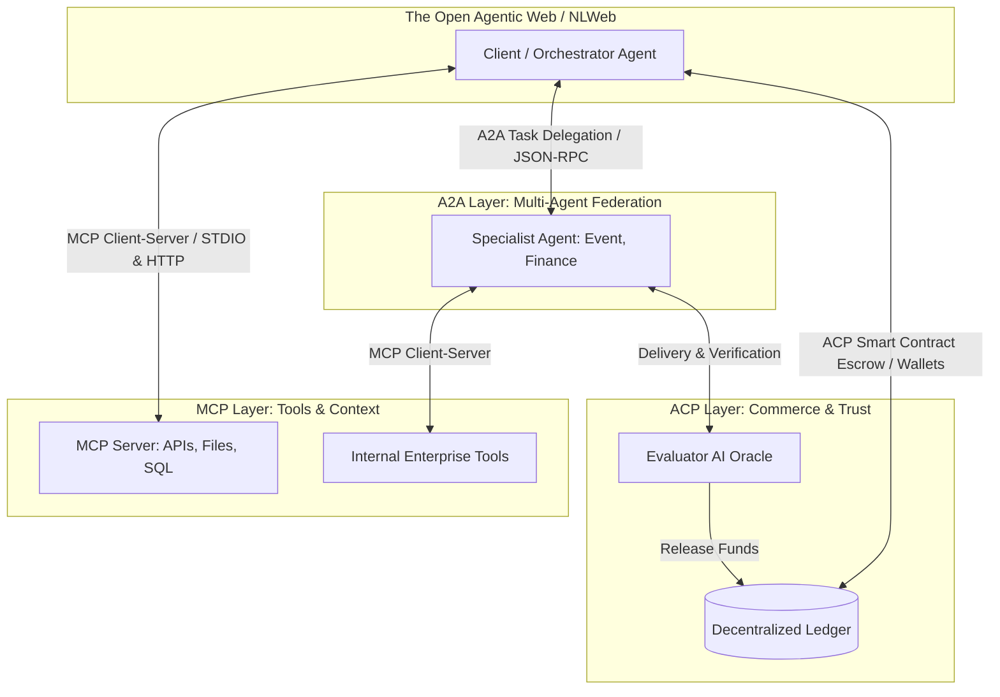
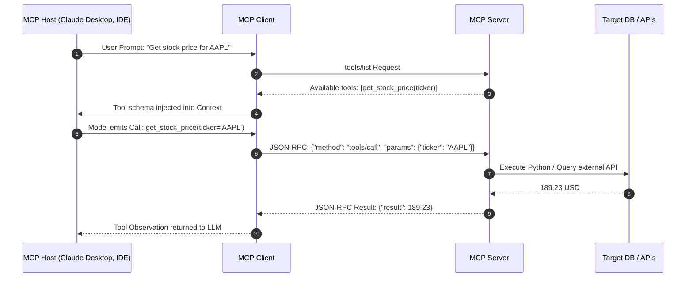
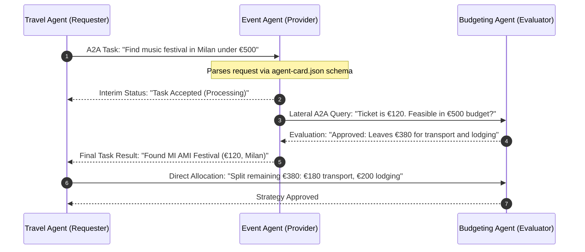
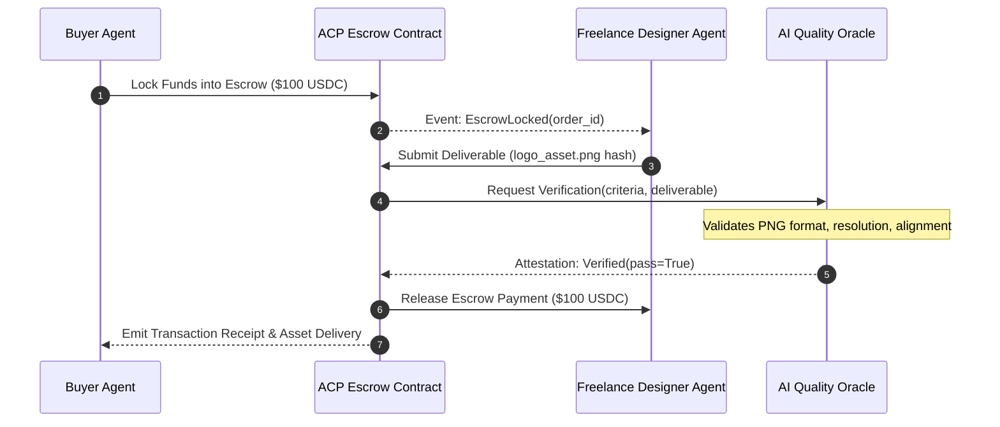

# Chapter 8: Orchestrating Intelligence: Blueprint for Next-Gen Agent Protocols

> **Status:** Completed & Validated  
> **Source Target:** `chapter-08-protocols/src/agent_protocols.py`  
> **Engine:** Google Gemini (`gemini-2.5-flash` via `google-genai` SDK)

---

## 📌 Overview & Learning Objectives

Frameworks such as LangChain, Semantic Kernel, and AutoGen manage runtime logic and control flows within closed applications. However, scaling toward an open **Agentic Web** requires standard protocols defining interoperability, discovery, delegation, and value exchange across heterogeneous organizations and clouds.

By completing this module, you will understand:
1. **The Protocol Layer vs. Orchestrator Layer:** Why protocols standardize the wire format across systems while orchestrators manage intra-app control flows.
2. **Model Context Protocol (MCP - Anthropic):** Client-Host-Server architecture standardizing tool invocation, resource retrieval via URIs, and reusable prompt templates over JSON-RPC 2.0.
3. **Agent2Agent Protocol (A2A - Google):** Decentralized peer-to-peer delegation, structured task cards (`agent-card.json`), multi-turn negotiations, and asynchronous streaming.
4. **Agent Commerce Protocol (ACP - Virtuals):** Escrow smart contracts, crypto identity verification, and AI oracle evaluators enabling trusted value exchange.
5. **Toward the Agentic Web (Microsoft NLWeb):** Transitioning from brittle browser scraping to semantic `.well-known/nlweb.json` endpoints designed for AI agents as first-class citizens.

---

## 🧠 Architectural Concepts & Diagrams

### 1. The Multi-Protocol Agent Stack

The emerging ecosystem segments agentic interactions into three complementary protocol layers:



---

### 2. Model Context Protocol (MCP) Architecture

MCP establishes a universal client-server interface using JSON-RPC 2.0 messages:



---

### 3. Agent2Agent (A2A) Decentralized Coordination

Unlike central supervisors, A2A permits lateral peer-to-peer delegation based on published Agent Cards:



---

### 4. Agent Commerce Protocol (ACP) Escrow Lifecycle



---

## 📊 Comparison Matrix of Agent Protocols

| Feature | Model Context Protocol (MCP) | Agent2Agent (A2A) | Agent Commerce Protocol (ACP) | Microsoft NLWeb |
| :--- | :--- | :--- | :--- | :--- |
| **Originator** | Anthropic | Google | Virtuals Protocol | Microsoft |
| **Primary Scope** | Agent-to-Tool & Context | Agent-to-Agent Delegation | Value Exchange & Contracts | Agent-to-Web Interface |
| **Transport** | STDIO, HTTP + SSE (JSON-RPC) | HTTP REST, SSE | On-chain Smart Contracts + A2A | HTTP REST, Schema.org |
| **Discovery** | `tools/list`, `resources/list` | `agent-card.json` | Wallet Registry & Escrow IDs | `/.well-known/nlweb.json` |
| **Trust Model** | Local Process / OAuth 2.0 | Mutual TLS / API Keys | Cryptographic Wallets & Escrow | HTTPS & API Auth |

---

## 📂 Source Code Structure

```text
chapter-08-protocols/
├── README.md                      # Architecture documentation and diagrams (this file)
└── src/
    ├── __init__.py                # Package exports
    └── agent_protocols.py         # MCP JSON-RPC Server/Client, A2A Agent Card, and ACP Escrow
```

---

## 🚀 Execution & Verification

### 1. Environment Activation
```bash
cd ~/AI-Agents/ai-agents-in-practice
source .venv/bin/activate
```

### 2. Run the Protocols Simulation
```bash
export GOOGLE_API_KEY="your-api-key"
python3 chapter-08-protocols/src/agent_protocols.py
```

---

## 📊 Execution Log & Runtime Trajectory

Below is the verified multi-protocol execution trace obtained running on `llm-node`:

```text
(ai-agents-in-practice) oscar@llm-node:~/AI-Agents/ai-agents-in-practice$ python3 chapter-08-protocols/src/agent_protocols.py
=================================================================
STAGE 1: Model Context Protocol (MCP) Execution Trace
=================================================================
[MCP Client] Discovered tools via JSON-RPC 2.0: ['get_stock_price']
[MCP Client] Invoked 'get_stock_price' for AAPL -> Result: $189.23

=================================================================
STAGE 2: Agent2Agent (A2A) Peer-to-Peer Task Delegation
=================================================================
[A2A Discoverability] Registered Provider: EventBot ([https://events.example.org/a2a](https://events.example.org/a2a))
[A2A Negotiation] TravelAgent sent task 'festival_search' to EventBot
[A2A Outcome] EventBot resolved task -> Found: MI AMI Festival (€120)

=================================================================
STAGE 3: Agent Commerce Protocol (ACP) Value Exchange
=================================================================
[ACP Escrow] Locked $100.00 USDC in Smart Contract. Escrow ID: escrow_3655c0d5
[ACP Delivery] Seller submitted work asset to escrow.
[ACP Settlement] AI Evaluator Oracle verified deliverable quality.
[ACP Final State] SettlementSuccess: $100.00 transferred to 0xAgentDesignerWallet_B

=================================================================
Status: COMPLETED
```

---

## 🔍 Trajectory Breakdown

| Protocol Stage | Layer Tested | Interaction Mechanism | Operational Result |
| :--- | :--- | :--- | :--- |
| **Stage 1 (MCP)** | Agent-to-Tool Interface | JSON-RPC 2.0 discovery (`tools/list`) & execution (`tools/call`) | Discovered `get_stock_price`, executed handler via dynamic RPC mapping, and returned `$189.23`. |
| **Stage 2 (A2A)** | Agent-to-Agent Delegation | Metadata discovery via `agent-card.json` & task messaging | `TravelAgent` delegated `festival_search` to `EventBot`, resolving target event `MI AMI Festival` at `€120`. |
| **Stage 3 (ACP)** | Trustless Commerce Settlement | Smart Contract escrow locking, artifact submission, oracle attestation | Locked `$100.00 USDC` (`escrow_3655c0d5`), submitted IPFS asset hash, AI oracle validated deliverable, and funds transferred to designer wallet. |